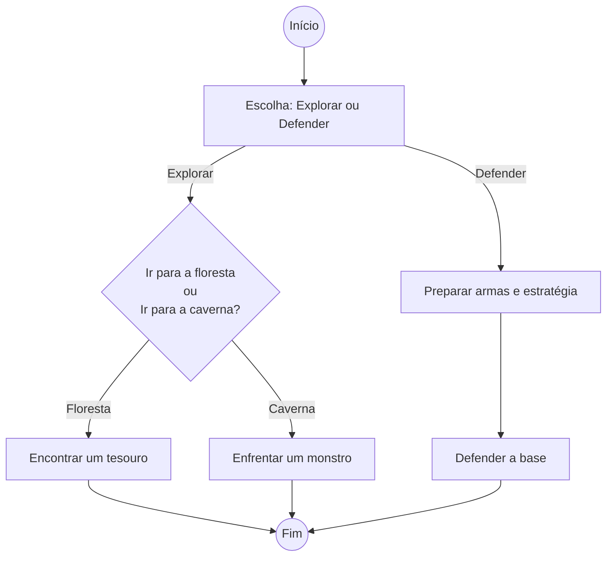
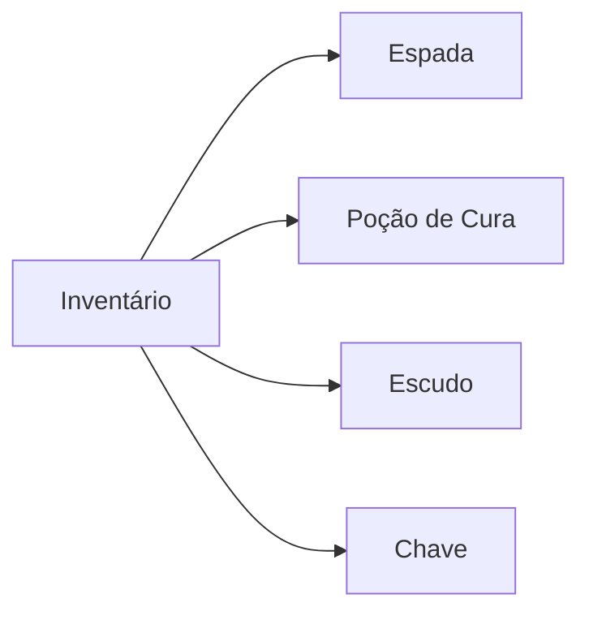

# Documentação do Jogo
## Instruções e Flowchart

### Requisitos do Jogo
- Mínimo de 2 jogadores
- Plataforma: PC
- Controles: Teclado e rato

### Imagem do Jogo

### Website Oficial
[Visite o Website Oficial](http://www.ulusofona.pt)

### Fluxograma do Jogo

# Notas Finais

## Inventário

## Como vencer o jogo

1. Escolhe explorar ou defender com base na situação.
2. Se decidires explorar, avalia os riscos antes de entrar na floresta ou na caverna.
3. Se decidires defender, prepara as tuas armas e estratégia com antecedência.
3. Usa itens que encontrares, como poções e chaves, para aumentar as tuas hipóteses de sucesso.
4. Para vencer, adapta a tua estratégia conforme o desenrolar dos eventos.

